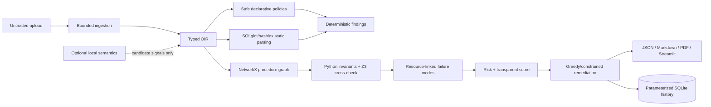

# Architecture and trust boundaries

## Trust boundary

Upload bytes and evidence are hostile data. Ingestion bounds size/type/encoding and strips paths. Commands are parsed into text/AST structures and can never reach a shell, subprocess, database connection, `eval`, or `exec`. Policies are fixed local metadata loaded with `yaml.safe_load`, allow-listed keys, typed validation, and a fixed evaluator ID registry—never dynamic imports. UI evidence uses Streamlit text/code APIs rather than unsafe HTML.

## Components

- **Ingestion:** TXT/Markdown lines and DOCX paragraph/table locations.
- **OIR:** sections, ordered steps, source references, actions, targets, commands, and risk/control tags.
- **Rules:** 34 generic and domain-specific metadata records dispatch only stable allow-listed evaluators.
- **Commands:** sqlglot/bashlex primary paths with lexical/shlex fallbacks and parser provenance.
- **Graph:** production `MultiDiGraph`, resources and typed relationships, serialized for UI, with safeguard/verification/recovery diagnostics and a critical risk path.
- **Formal layer:** explainable INV-A/B/C/D/F results; Z3 checks finite order consistency when installed and records disagreement diagnostics.
- **Failure/risk:** control-to-resource matching, uncovered modes, nine visible normalized risk factors.
- **Scoring/remediation:** deduplicated category-capped scoring; greedy and exact budget-constrained remediation plans.
- **Semantics/calibration:** optional local candidate backend and isolated experimental BayesianRidge calibration, disabled without legitimate labels.
- **Persistence:** logical runbook identity, immutable versions, score/category/failure/graph snapshots, and regression deltas.
- **Reports/UI:** JSON, Markdown, PDF, graph visualization, critical risk path, filters, comparisons, and explicit limitations.
